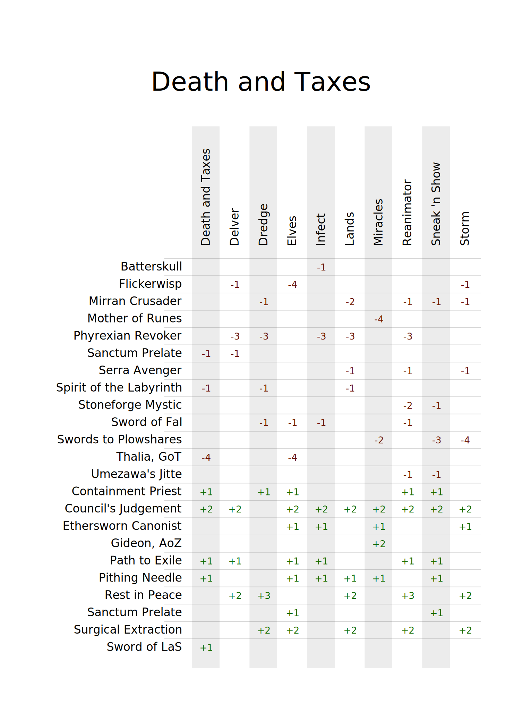

# Magic: The Gathering Sideboard Tools

## Initial idea and credits

Original Jupyter notebook and idea by [Sebastian Proost](https://github.com/sepro).

Refined and extended by [gate/mindbreaktrap](https://github.com/mindbreaktrap).

JSON template by [Tommy Hinks](https://github.com/thinks).

The original notebook turned a .txt file into a .svg using Pandas and a Jinja2 template.
An example can be seen below.

I extended this idea to use a .json file as the source as that is much more readable and easier to edit.

## Roadmap

I am planning on extending this tool suite to allow import of decklists from other sources, such as MTGO, Arena, and other decklist sites.

I also want to make the process of creating the .json file easier by creating a web interface to input data and validate it.

## Setup and usage

TBA

